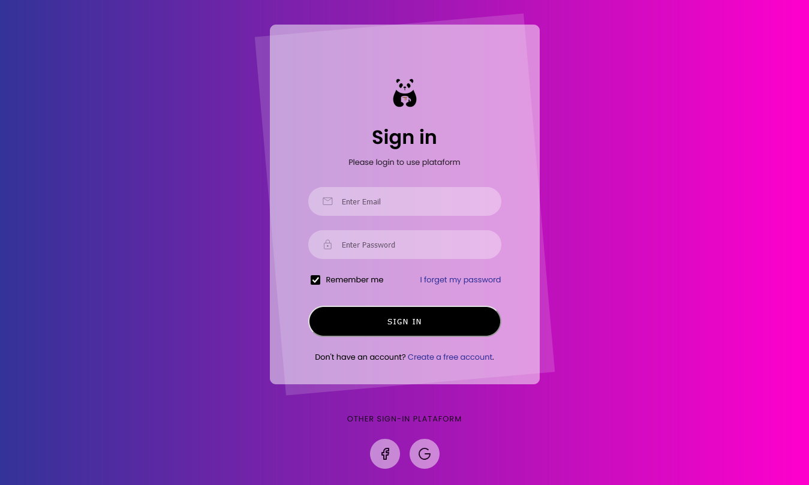

<h1 align="center"> Login page </h1>

Página de login feita para entender e massificar conceitos de html e css.

  <a href="#-tecnologias">Tecnologias</a>&nbsp;&nbsp;&nbsp;|&nbsp;&nbsp;&nbsp;
  <a href="#-projeto">Projeto</a>&nbsp;&nbsp;&nbsp;|&nbsp;&nbsp;&nbsp;
  <a href="#-layout">Layout</a>&nbsp;&nbsp;&nbsp;|&nbsp;&nbsp;&nbsp;
  <a href="#memo-licença">Licença</a>

  

 

  

## 🚀 Tecnologias

Esse projeto foi desenvolvido com as seguintes tecnologias:

- HTML e CSS
- Git e GitHub

## 💻 Projeto

O projeto símula uma página de login.

## 🔖 Layout

Você pode visualizar a base do projeto através [DESSE LINK](https://www.youtube.com/watch?v=B6e4Fg_-CXY).

## :memo: Licença

Esse projeto está sob a licença MIT.

---

Feito com ♥ by Lucas Reis :wave: 